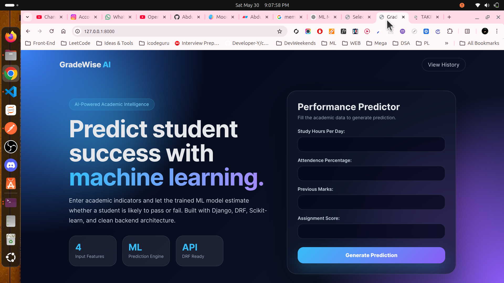
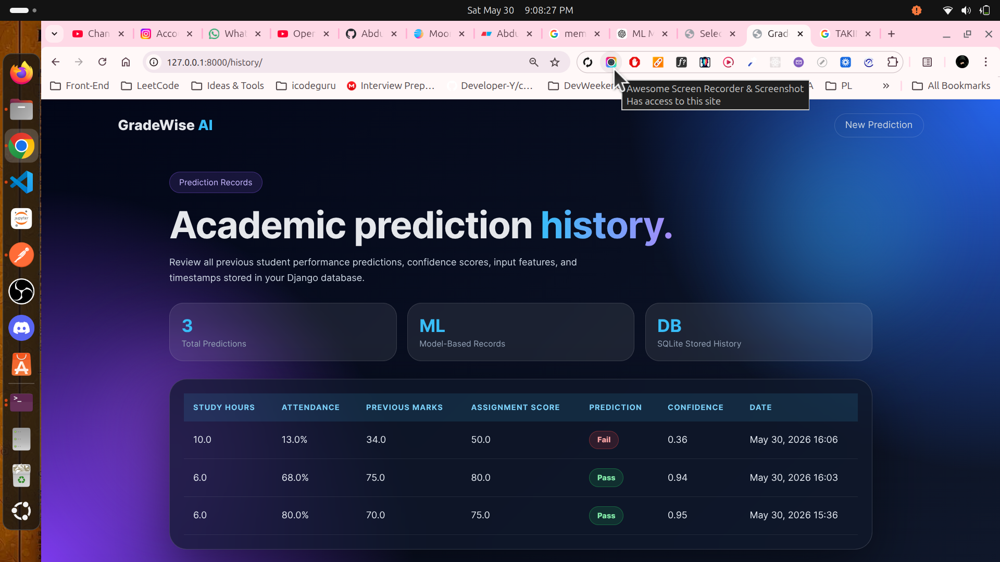
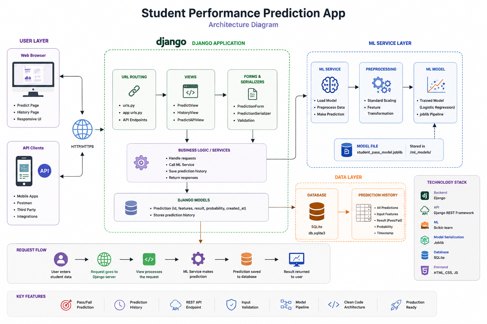

# 🎓 GradeWise AI

> An intelligent student performance prediction platform built with Django, Django REST Framework, and Machine Learning.

GradeWise AI analyzes academic indicators such as study hours, attendance, previous marks, and assignment performance to predict whether a student is likely to pass or fail. The application combines a modern Django architecture with a trained Scikit-learn model to demonstrate real-world machine learning integration in a web application.

---

## ✨ Features

### 🤖 Machine Learning Prediction

* Student pass/fail prediction
* Confidence score generation
* Trained Scikit-learn model
* Pipeline-based preprocessing

### 🌐 Web Application

* Modern responsive interface
* Interactive prediction form
* Real-time prediction results
* Animated dashboard experience

### 📊 Prediction History

* Stores all predictions
* Historical performance records
* Confidence tracking
* Timestamped predictions

### 🔌 REST API

* Django REST Framework integration
* JSON request/response support
* API-ready architecture
* Easy third-party integration

### 🛡️ Validation & Error Handling

* Input validation
* Form validation
* Serializer validation
* Safe model loading

---

## 📸 Screenshots

### Prediction Dashboard



---

### Prediction History



---

## 🏗️ System Architecture

```text
User Input
    │
    ▼
Django Form / API
    │
    ▼
Validation Layer
    │
    ▼
ML Service Layer
    │
    ▼
Scikit-learn Model
    │
    ▼
Prediction Result
    │
    ▼
Database Storage
```

---

## 🛠️ Tech Stack

### Backend

* Python
* Django
* Django REST Framework

### Machine Learning

* Scikit-learn
* Pandas
* Joblib

### Database

* SQLite

### Frontend

* HTML5
* CSS3
* Glassmorphism UI
* CSS Animations

---

## 📂 Project Structure

```text
GradeWise/
│
├── manage.py
├── requirements.txt
│
├── ml_models/
│   └── student_pass_model.joblib
│
├── training/
│   └── train_model.py
│
├── predictor/
│   ├── services/
│   │   └── ml_service.py
│   │
│   ├── templates/
│   │   └── predictor/
│   │       ├── predict.html
│   │       └── history.html
│   │
│   ├── forms.py
│   ├── models.py
│   ├── serializers.py
│   ├── urls.py
│   └── views.py
│
└── GradeWise/
    ├── settings.py
    ├── urls.py
    └── wsgi.py
```

---

## 🧠 Machine Learning Workflow

### Input Features

The model uses four academic indicators:

| Feature          | Description             |
| ---------------- | ----------------------- |
| Study Hours      | Daily study time        |
| Attendance       | Attendance percentage   |
| Previous Marks   | Previous academic score |
| Assignment Score | Assignment performance  |

### Prediction Output

```text
Pass
or
Fail
```

### Confidence Score

```text
0.00 → 1.00
```

Higher values indicate stronger model confidence.

---

## 🚀 Installation

### Clone Repository

```bash
git clone https://github.com/Abdullah-Niaz/GradeWise-AI.git
cd gradewise-ai
```

### Create Virtual Environment

```bash
python -m venv venv
```

### Activate Environment

Linux/macOS

```bash
source venv/bin/activate
```

Windows

```bash
venv\Scripts\activate
```

### Install Dependencies

```bash
pip install -r requirements.txt
```

### Train Model

```bash
python training/train_model.py
```

### Run Migrations

```bash
python manage.py makemigrations
python manage.py migrate
```

### Start Server

```bash
python manage.py runserver
```

---

## 🌐 Application URL

```text
http://127.0.0.1:8000/
```

---

## 🔌 API Endpoint

### Request

```http
POST /api/predict/
```

### Sample Request

```json
{
    "study_hours": 6,
    "attendance": 80,
    "previous_marks": 70,
    "assignment_score": 75
}
```

### Sample Response

```json
{
    "prediction": "Pass",
    "probability": 0.87
}
```

---

## 📈 Future Improvements

* Multiple ML model comparison
* Student analytics dashboard
* Performance trend visualization
* Authentication system
* PDF report generation
* Export to Excel
* Teacher dashboard
* Model version management
* Docker deployment
* PostgreSQL support

---

## 🎯 Learning Objectives

This project demonstrates:

* Django Fundamentals
* Django REST Framework
* Machine Learning Integration
* Service Layer Architecture
* Form Validation
* API Development
* Database Design
* Model Serialization
* Prediction Logging
* Clean Project Structure

---

## 👨‍💻 Author

### Abdullah Niaz

Software Engineer | Django Developer | Machine Learning Enthusiast

GitHub: https://github.com/Abdullah-Niaz
